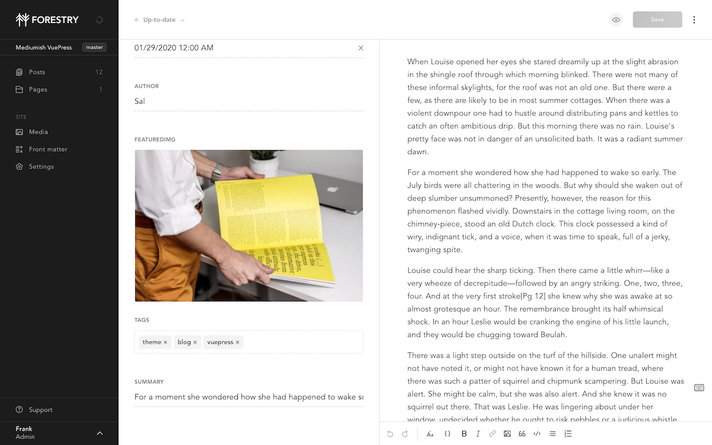

# VuePress Theme Mediumish

This is a free VuePress Bootstrap Blogging Theme, Medium styled, fully featured: multi author, search, categories, newsletter, Disqus, RSS, sitemap, TOC, Prism, 100% Github pages compatible, ready for automatic deployment.

[View Demo](https://wowthemesnet.github.io/vuepress-theme-mediumish/) | [View Documentation](https://bootstrapstarter.com/bootstrap-templates/vuepress-theme-mediumish/)


## Content Management

<a href="https://app.forestry.io/quick-start?repo=dirtyf/mediumish-vuepress-blog-theme&engine=vuepress">
    
</a>

Import in [Forestry](https://forestry.io) to be able to edit and preview your posts before publishing.



## Development

```
# install dependencies
yarn 
# preview changes locally
yarn start
```

## Deployment

Import your repository in [Vercel](http://vercel.com) and deploy for free

[](https://vercel.com/import/git)


